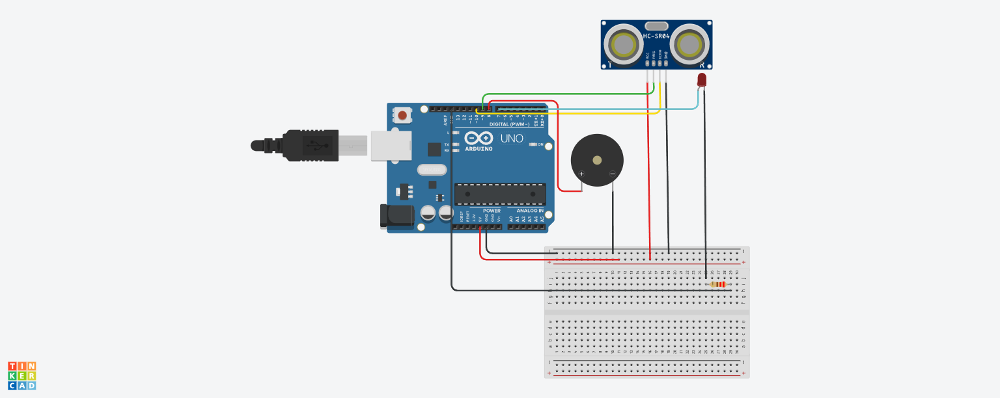
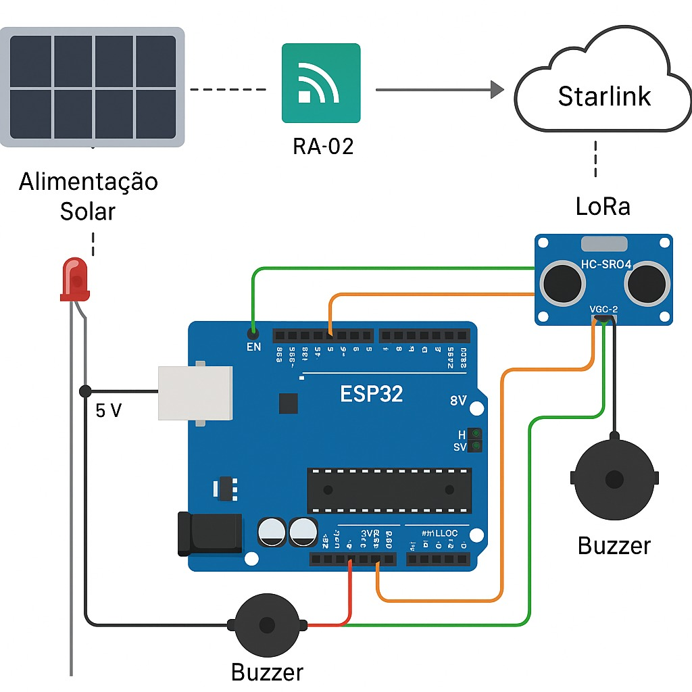
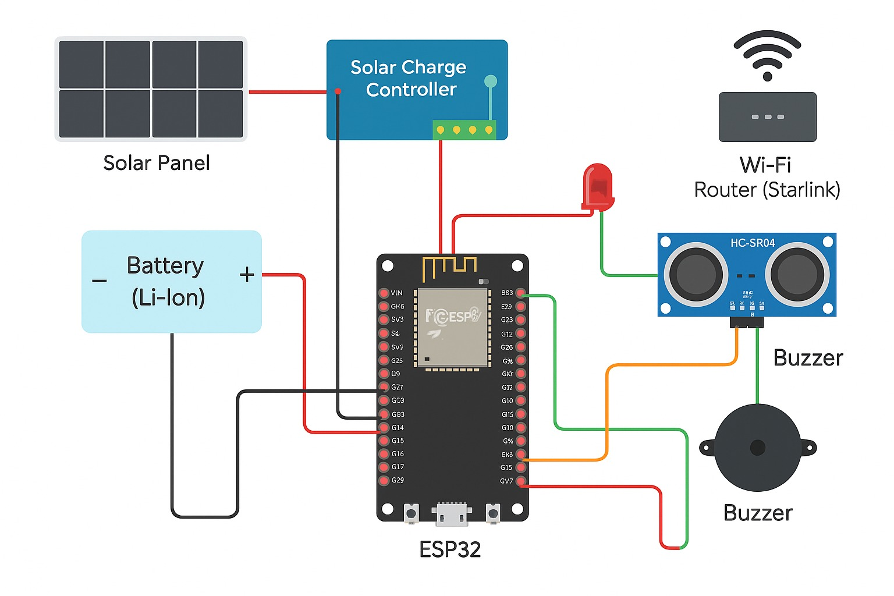

# 🌊 Sistema de Monitoramento Ambiental

## 📋 Visão Geral

Este projeto implementa um sistema de monitoramento ambiental em três fases evolutivas, utilizando Arduino/ESP32 para monitorar parâmetros ambientais críticos como nível de água, temperatura e pressão atmosférica.

## 🚀 Fases do Projeto

### 1️⃣ Simulador de Alerta de Nível de Água

🔍 Detalhes da Fase 1

#### 📸 Circuito

#### 💻 Código
[Ver código completo](./1-Simulador_Nivel_Agua/index.ino)

#### ⚡ Funcionalidades
- Medição de nível de água via sensor ultrassônico
- Sistema de alerta sonoro e visual
- Monitoramento via Serial
- Interface simples e direta

### 2️⃣ Simulador de Monitoramento Ambiental

🔍 Detalhes da Fase 2

#### 📸 Circuito

#### 💻 Código
[Ver código completo](./2-Simulador_Monitoramento/index.ino)

#### ⚡ Funcionalidades
- Monitoramento multi-parâmetros:
  - Nível de água
  - Temperatura
  - Pressão atmosférica
- Sistema de alerta integrado
- Monitoramento via Serial
- Interface expandida

### 3️⃣ Sistema Completo de Monitoramento Ambiental

🔍 Detalhes da Fase 3

#### 📸 Circuitos

  
  
<em>Circuito - Parte 1</em>

  
  
<em>Circuito - Parte 2</em>

#### 💻 Código
[Ver código completo](./3-Simulador_Monitaramento_Completo/index.ino)

#### ⚡ Funcionalidades
- Todas as funcionalidades da fase 2
- Estrutura preparada para comunicação Wi-Fi
- Formatação de dados em JSON
- Sistema de alerta avançado
- Interface completa

## 🛠️ Componentes Utilizados

### 📊 Sensores
- **Sensor Ultrassônico HC-SR04**
  - Fase 1: Medição de nível de água
  - Fase 3: Integração com sistema completo
- **Sensor de Temperatura**
  - Fases 2 e 3: Monitoramento térmico
- **Sensor de Pressão Atmosférica**
  - Fases 2 e 3: Monitoramento barométrico

### 🔔 Atuadores
- **LED de Alerta**
  - Todas as fases: Indicador visual
- **Buzzer**
  - Todas as fases: Alerta sonoro

### 💻 Microcontrolador
- **Arduino/ESP32**
  - Compatível com todas as fases
  - Suporte a comunicação Wi-Fi (Fase 3)

## 📊 Especificações Técnicas

### ⚠️ Limites de Alerta
| Parâmetro | Limite | Unidade |
|-----------|---------|----------|
| Nível de Água | ≥ 75.0 | cm |
| Temperatura | ≥ 35.0 | °C |
| Pressão Atmosférica | ≤ 980.0 | hPa |

### 📏 Faixas de Medição
| Parâmetro | Mínimo | Máximo | Unidade |
|-----------|---------|---------|----------|
| Nível de Água | 0.0 | 100.0 | cm |
| Temperatura | -10.0 | 50.0 | °C |
| Pressão Atmosférica | 950.0 | 1050.0 | hPa |

## 🔄 Evolução do Projeto

1. **Fase 1**: Sistema básico de medição
   - Implementação inicial
   - Foco em medição de nível

2. **Fase 2**: Expansão multi-parâmetros
   - Adição de sensores
   - Sistema integrado

3. **Fase 3**: Sistema completo
   - Preparação para comunicação
   - Interface avançada

## 📝 Notas de Desenvolvimento

- Desenvolvimento incremental por fases
- Código documentado e comentado
- Estrutura modular e expansível
- Preparado para futuras implementações

## 📄 Licença

Este projeto está sob a licença MIT. Veja o arquivo [LICENSE](LICENSE) para mais detalhes.

---